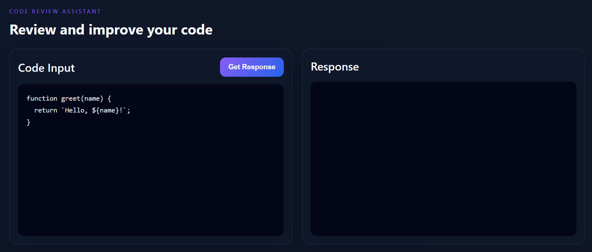
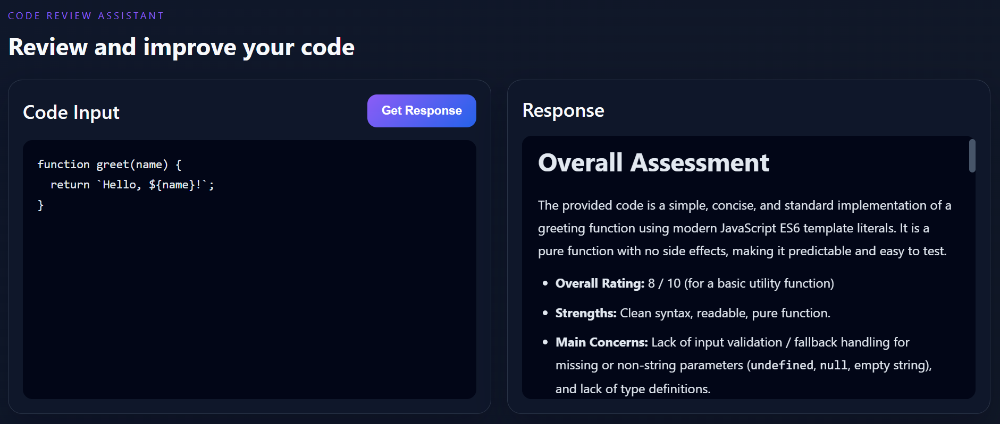

#  Code Reviewer

An AI-powered Code Review Assistant that analyzes source code, identifies potential issues, and provides suggestions for improving code quality, readability, and best practices.

## Live Demo
https://code-reviewer-lemon-delta.vercel.app/

##  Features

-  AI-powered code review
-  Suggests improvements and best practices
-  Syntax highlighting
-  Fast and responsive UI
-  Copy reviewed code easily
-  Full-stack application with React and Node.js

---

##  Tech Stack

### Frontend
- React
- Vite
- PrismJS
- Axios
- CSS

### Backend
- Node.js
- Express.js
- Google Gemini API
- CORS
- dotenv

---

##  Project Structure

```
Code-Reviewer/
│
├── Frontend/
│   ├── src/
│   ├── public/
│   ├── package.json
│   └── vite.config.js
│
├── Backend/
│   ├── src/
│   ├── package.json
│   └── server.js
│
└── README.md
```

---

##  Installation

### Clone the repository

```bash
git clone https://github.com/kanishka-rani-2005/Code-Reviewer.git
```

```bash
cd Code-Reviewer
```

---

## Backend Setup

Navigate to the backend folder:

```bash
cd Backend
```

Install dependencies:

```bash
npm install
```

Create a `.env` file:

```env
GEMINI_API_KEY=your_api_key
PORT=3000
CORS_ORIGIN=
```

Start the backend server:

```bash
npm run dev
```

---

## Frontend Setup

Open another terminal:

```bash
cd Frontend
```

Install dependencies:

```bash
npm install
```

Create a `.env` file:

```env
VITE_API_LINK=http://localhost:3000/api/get-review
```

Start the frontend:

```bash
npm run dev
```

---

##  Screenshots




---

##  Contributing

Contributions are welcome!

1. Fork the repository
2. Create a new branch

```bash
git checkout -b feature-name
```

3. Commit your changes

```bash
git commit -m "Add new feature"
```

4. Push your branch

```bash
git push origin feature-name
```

5. Open a Pull Request

---

##  License

This project is licensed under the MIT License.

---

##  Author

**Kanishka Rani**

---

⭐ If you like this project, don't forget to give it a star!
